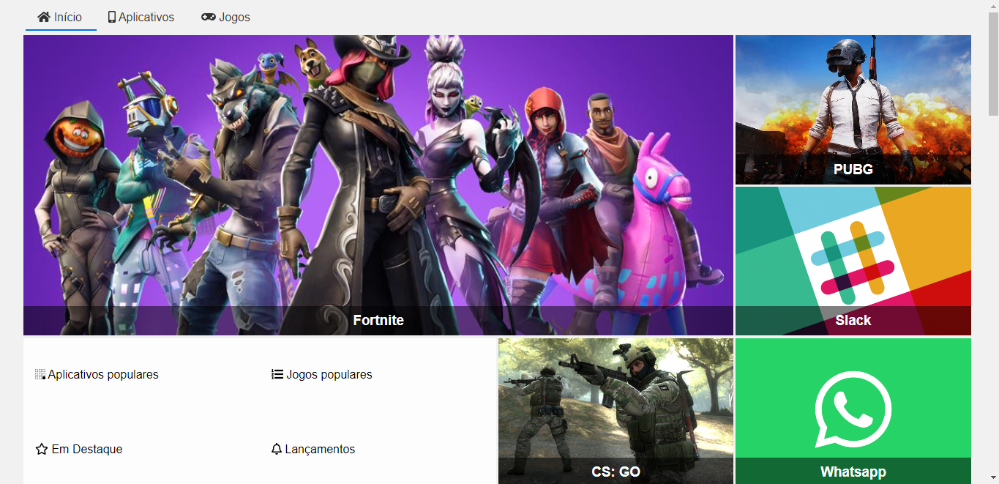

# Alura-GridLayout

Course provided by **Alura**, which has **Matheus Henrique Castiglioni** as an instructor: 
<a href="https://cursos.alura.com.br/course/css-grid-layout" target="_blank"> Click here to access </a>

# Site Preview

| 1° Preview Image | 2° Preview Image | 
|------------------|------------------|
||| 

# Course Concept 

The idea is to build the "Alura Store", the new platform of Alura that sells a lot of popular games on the market.

# Major Knowledge 

- CSS: Grid
- How to work with Grid Layout 
- Responsive Grid Layout  

> If you compare this project to the actual course project and see differences, this happens because the course had an
>  update and I didn't make it again.
>  
